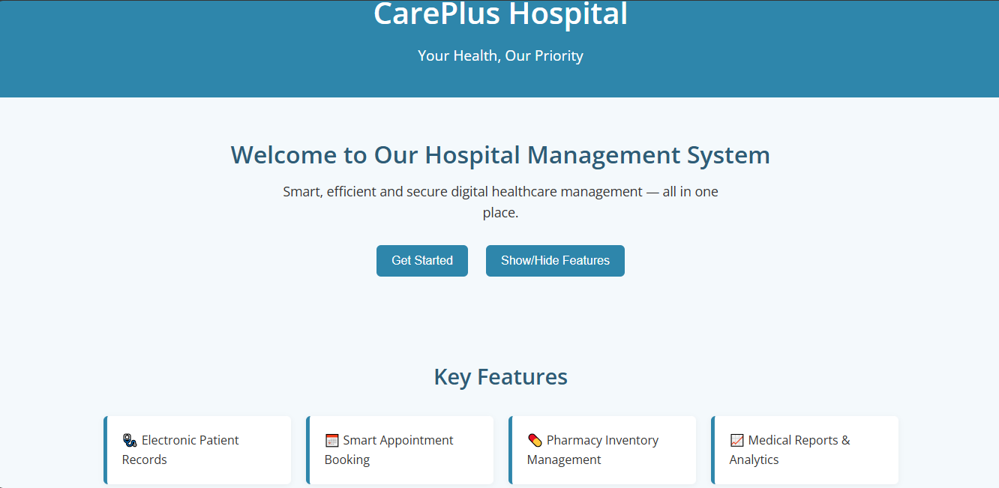
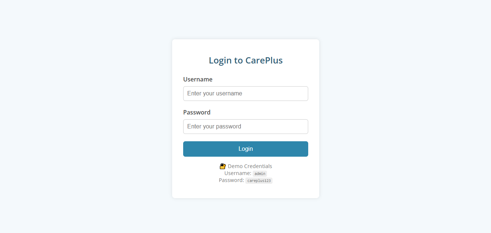
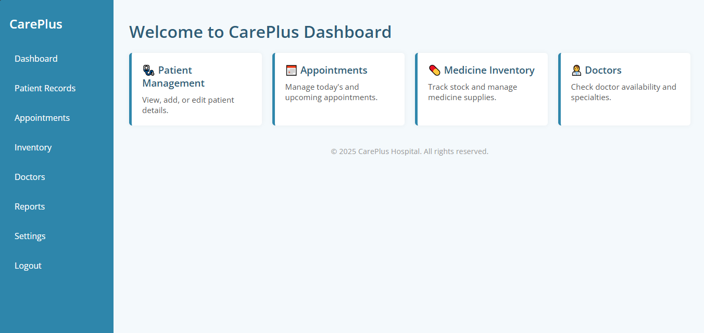
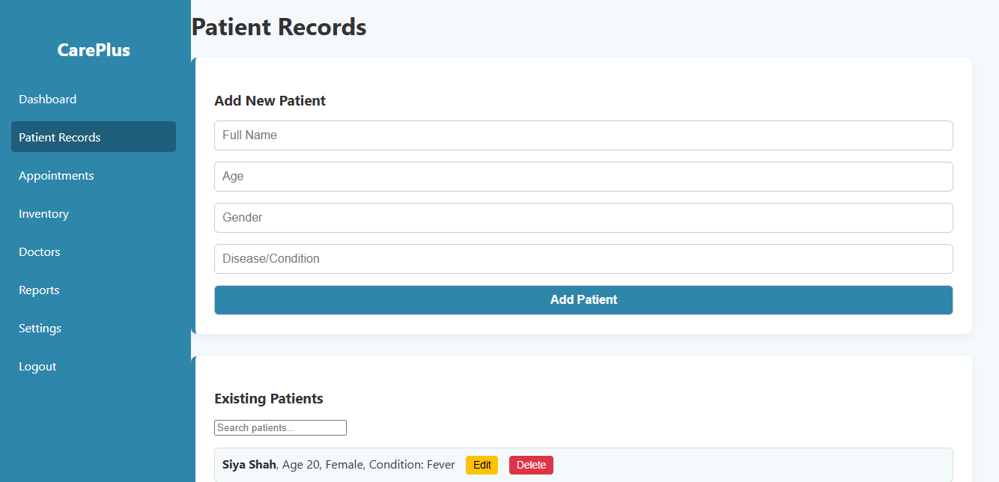
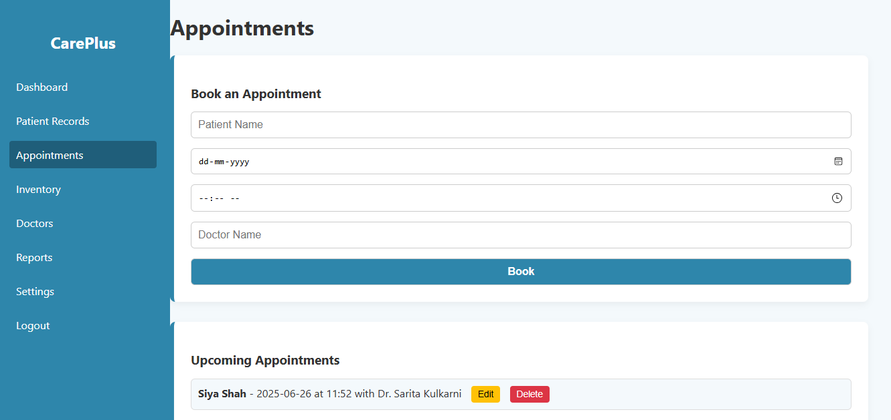
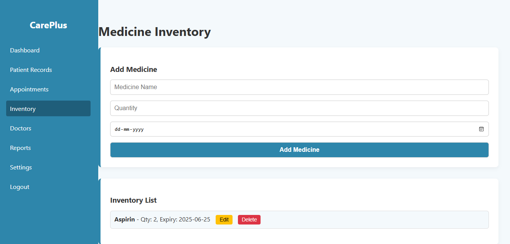
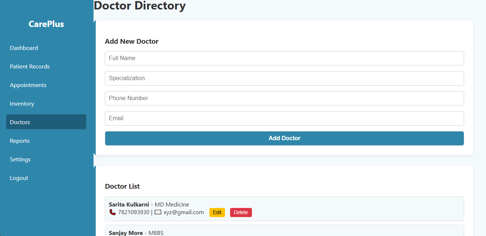
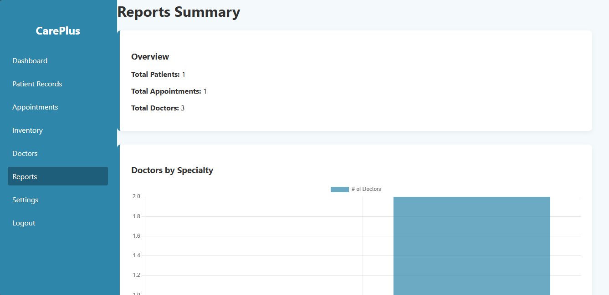
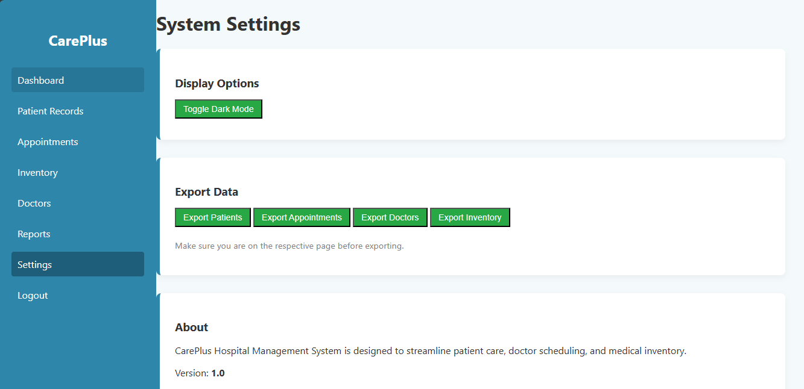

# 🏥 Healthcare Admin Portal – CarePlus

A responsive, multi-page healthcare management dashboard built using HTML, CSS, and JavaScript. This frontend-only project simulates hospital admin features like patient record management, appointment scheduling, doctor directory, inventory tracking, and visual reporting.

## 📸 Screenshots

### Landing Page

### Login Page

### Dashboard

### Patients Page

### Appointments Page

### Inventory Page

### Doctors Page

### Reports Page

### Settings Page

---

## 🚀 Live Demo

[View Live Project](https://siya1605.github.io/healthcare-admin-portal/)

---

## ✨ Features

- Responsive layout
- Simulated login authentication
- Patient and appointment management
- Doctors list and inventory section
- CSV export functionality
- LocalStorage-based data persistence
- Chart-based visual reporting

---

## 🔐 Demo Login
Username: admin

Password: careplus123

---

## 💻 Technologies Used

- HTML5  
- CSS3  
- JavaScript (ES6)  
- Chart.js  
- LocalStorage

---

## 📦 Folder Structure
healthcare-admin-portal/
├── index.html
├── login.html
├── dashboard.html
├── patients.html
├── appointments.html
├── inventory.html
├── doctors.html
├── reports.html
├── settings.html
├── script.js
├── style.css
└── README.md

## 📦 Setup Instructions (for local run)
1. Clone or download this repository
2. Open the folder in *VS Code* or any other editor
3. Run using Live Server or simply open index.html in a browser

# Optional: Git Clone
$ git clone https://github.com/siya1605/healthcare-admin-portal.git

---

## 🙋‍♀️ Author
Siya Shah
Frontend Developer | Portfolio Project

🔗 [LinkedIn](https://www.linkedin.com/in/siya-shah-04a67b286/) • [GitHub](https://github.com/siya1605)

---

## 📄 License
This project is licensed for learning and portfolio use only.